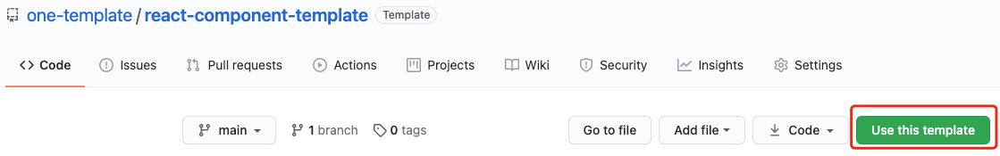

# 🌈 react-component-template

一个快速开发 React 组件的模板，满足组件开发、测试、打包、发布、文档开发、文档打包、文档部署。

[English](./README.md) | 简体中文

## 💖 如何使用？



## 💎 目录介绍

```
├── assets                 存放固定资源
├── docs                   组件文档
│   ├── example            Demo tsx
│   ├── changelog.md       用于展示组件历史
│   └── demo.md            用于展示组件 Demo
├── src                    组件主目录
│   ├── index.ts           组件注册
│   └── template.tsx       组件实现代码
├── tests                  组件测试代码
│   ├── __snapshots__      快照测试文件输出，不需手动修改
│   ├── setup.ts           初始化 jest 脚本
│   └── index.spec.tsx     测试文件
├── .eslintrc.js           eslint 配置
├── .fatherrc.ts           father 配置
├── .umirc.ts              dumi 配置
├── jest.config.js         jest 配置
└── tsconfig.json          typescript 配置
```

其余文件可自行查阅了解。

## 🤖 命令介绍

| 名称                     | 描述           | 备注                                                                     |
| ------------------------ | -------------- | ------------------------------------------------------------------------ |
| `npm run start`          | 组件开发       | 文档使用 [dumi](https://github.com/umijs/dumi)，组件开发和文档开发在一起 |
| `npm run test`           | 组件测试       | -                                                                        |
| `npm run lint`           | eslint 校验    | -                                                                        |
| `npm run build`          | 组件打包       | 使用 [father](https://github.com/umijs/father) 工具                      |
| `npm run coverage`       | 代码覆盖率查看 | -                                                                        |
| `npm publish`            | 组件发布       | 建议首次移除 prepublishOnly                                              |
| `npm run docs:build`     | 文档打包       | -                                                                        |
| `npm run docs-dev:build` | 文档打包       | 使用 dumi dev 环境                                                       |
| `npm run docs:deploy`    | 文档发布       | 这里默认是使用了 GitHub Pages                                            |
| `npm run deploy`         | 文档打包发布   | -                                                                        |

## 🍭 组件

### 开发

```bash
npm i
npm run start
# http://localhost:8000/
```

### 测试

```
npm run test
```

### 打包

```bash
npm run build
```

- 使用了 [father](https://github.com/umijs/father) 工具
- 更多查看官网配置
- 打包文件默认生成在 dist 文件中

### 发布

> `package.json` 介绍

1. 如果要进行 npm 发布，`private` 需设置为 `false`。
2. build 命令可根据实际情况修改。
3. main 决定安装组件后 import 指向。
4. files 包含发布时的文件，默认包含 README.md。
5. 其他根据字意即可理解。

## 📚 文档

### 启动

```bash
npm run start
```

### 在线预览

https://one-template.github.io/react-component-template/

### 说明

- 使用 [dumi](https://github.com/umijs/dumi)
- 使用基础布局，更多请自行添加
- 因文档部署在 GitHub Pages 上，`.umirc.ts` 的 `base` 和 `publicPath` 设置为了项目名
- 一个 🌰 : [ant-design-colorful](https://ant-design-colorful.github.io/ant-design-colorful/)

## 🎈 辅助

- [快捷修改工程名称](./rename.ts)
- [Issue 模板](https://github.com/one-template/issue-template)
- [PR 模板](https://github.com/one-template/pr-template)
- [Actions 使用](https://github.com/github-actions-workflows/.github)

## 🎉 谁在使用？

- [image-component/react-image-shadow](https://github.com/image-component/react-image-shadow)
- [image-component/react-image-dangling](https://github.com/image-component/react-image-dangling)

## License

[MIT](https://github.com/one-template/react-component-template/blob/main/LICENSE)
